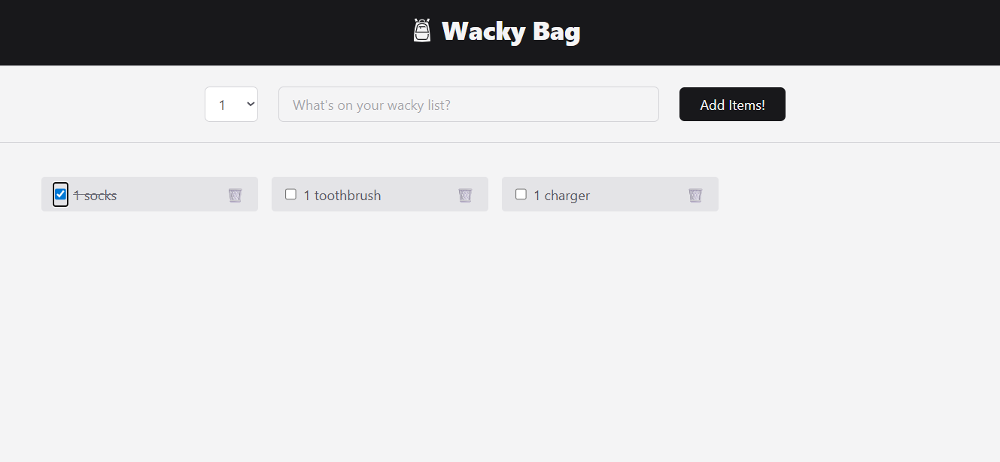

# Loadbags

Live demo: https://loadbags.onrender.com



## About

Loadbags is a lightweight React + Vite frontend for managing shopping bags/items. This repository contains the UI used in the demo linked above.

## Features

- Add, remove, and manage items
- Responsive UI built with React components
- Simple state management suitable for small apps

## Tech Stack

- React (JSX)
- Vite
- Plain CSS

## Getting Started

Clone the repo and install dependencies:

```bash
git clone https://github.com/yourusername/loadbags.git
cd loadbags
npm install
```

Run development server:

```bash
npm run dev
```

Build for production:

```bash
npm run build
```

Preview production build locally:

```bash
npm run preview
```

## Project Structure

- `src/` — React source files
- `src/components/` — UI components (Header, Form, Items, List, Footer, Overlay)
- `index.html`, `vite.config.js` — Vite setup

## Demo

Try the live demo: https://loadbags.onrender.com

## Contributing

Contributions are welcome. Open an issue or submit a pull request describing your change.

## License

This project is provided under the MIT License. See LICENSE for details.

## Contact

If you need help, open an issue in this repository.

